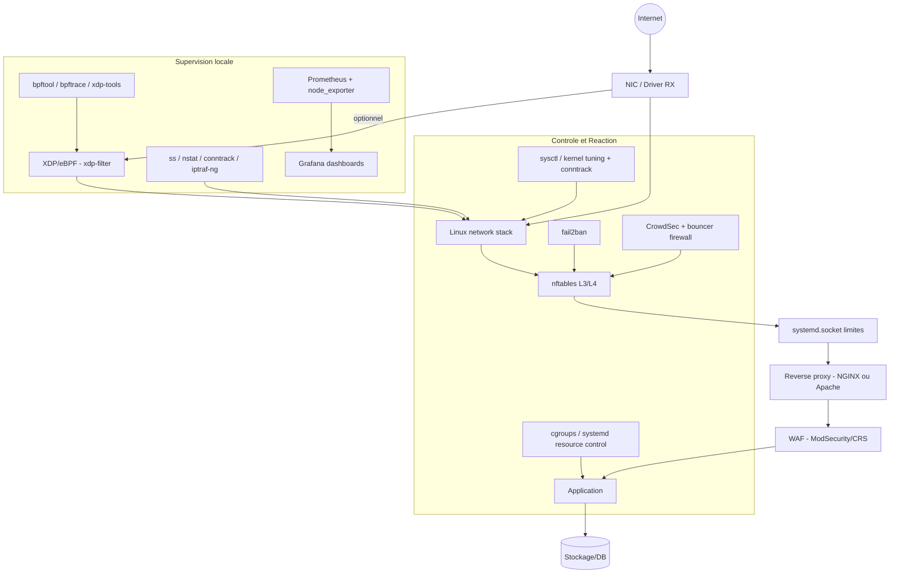
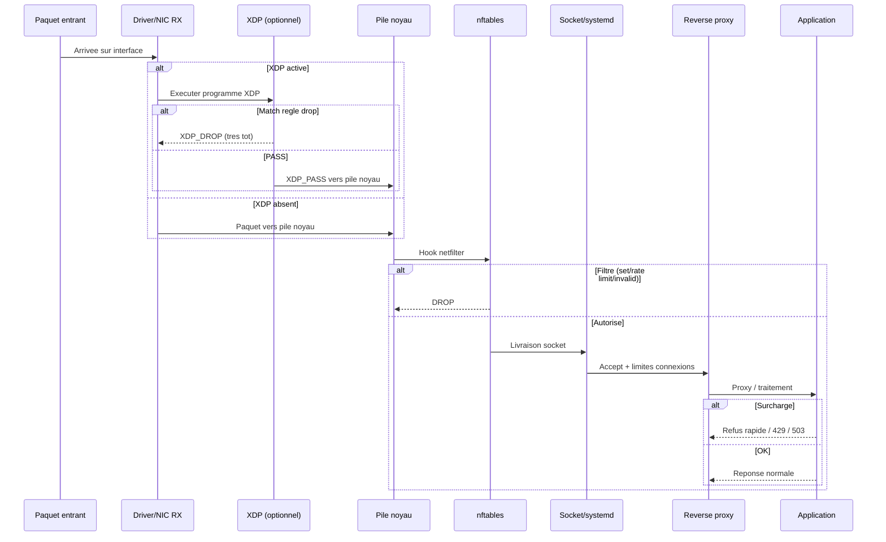

# BRCloud FluxGate - Architecture Anti-DDoS

## Diagramme de flux (defense en profondeur)

## Sequence de traitement d'un paquet

## Matrice des couches de protection

| Couche | Technologie | Vecteurs couverts | Fichier config |
|--------|-------------|-------------------|----------------|
| L2/L3 (driver) | XDP/eBPF | Volumetrique (pps), IP blocklist | `xdp/xdp-manage.sh` |
| L3/L4 (noyau) | nftables + sets | SYN flood, rate limit, invalid | `nftables/nftables.conf` |
| L4 (noyau) | sysctl tuning | SYN cookies, backlog, conntrack | `sysctl/99-fluxgate-hardening.conf` |
| L4 (systemd) | socket limits | Connexions/IP, backlog | `systemd/fluxgate-app.socket` |
| L7 (proxy) | NGINX/Apache | HTTP flood, slow requests, 429 | `nginx/nginx-fluxgate.conf` |
| L7 (WAF) | ModSecurity+CRS | Injections, abus applicatifs | `waf/modsecurity/modsecurity.conf` |
| Reactif | fail2ban/CrowdSec | Brute force, scans, abus repetes | `fail2ban/`, `crowdsec/` |
| Ressources | systemd cgroups | Epuisement CPU/RAM/FD | `systemd/resource-limits.conf` |
| Sortant | tc/tbf | Amplification sortante | `tc/tc-shape.sh` |

## Limites structurelles

1. **Saturation upstream** : si la bande passante FAI/hebergeur est saturee,
   le serveur ne voit pas tout le trafic. Solution : contacter l'operateur
   (blackholing, scrubbing center, service anti-DDoS cloud).

2. **DDoS massivement distribue** : des milliers d'IP changeantes rendent le
   filtrage IP moins efficace. BCP 38 (anti-spoofing) est hors controle local.

3. **Attaques L7 indiscernables** : requetes valides mais couteuses necessitent
   du backpressure applicatif, du caching, et potentiellement un WAF avec
   regles metier.

## Checklist de deploiement

1. Inventorier l'exposition reseau (`ss -lntu`)
2. Mesurer un baseline (trafic, connexions, latences, conntrack)
3. Fixer des SLO degrades (quels endpoints survivent, comportement 429/503)
4. Activer SYN cookies + backlog (`sysctl`)
5. Deployer nftables (default deny, sets, rate limit, drop UDP inutile)
6. Tuner conntrack (monitoring, timeouts, mode degrade)
7. Deployer reverse proxy (limit_req, limit_conn, timeouts)
8. Durcir contre slow requests (mod_reqtimeout / timeouts NGINX)
9. Ajouter fail2ban / CrowdSec
10. Confiner les ressources (systemd cgroups)
11. Activer XDP si besoin haute performance
12. Deployer monitoring (Prometheus + Grafana)
13. Tests reguliers et exercices de procedure
